  <a href="./README-PT.md">🇧🇷 Ler em Português</a>

<h3>🐳 Welcome!</h3>

  
Statistics

   
  

    
     
    
     
    
  

<h3>🔬 Who is @controlado?</h3>

  
Background

  

    

      I've been working and making a living as a back-end programmer for 5 years.
    

    

      It all started because of a challenge I faced with a small online shop I used to run.
       The question was: how could I sell to customers while I was asleep?
    

    

      The shop was small, the profit minimal, but it was frustrating to wake up to messages from people wanting to buy things overnight.
      The available solution was a third-party system costing R$1,000.00 – money I simply didn't have.
      So, I began learning JavaScript, but honestly, I wasn't passionate about it, you know?
    

    

      I switched to Python and really enjoyed studying that language.
    

    

      Then, <a href="https://github.com/iIlusion">a great friend</a> (who was also a customer at the time) started creating his own little shop too.
      With that, he helped me program, taught me what he knew, and I managed to significantly improve my own little shop.
    

    

      After months studying Python, I realized I enjoyed programming much more than having that little shop, despite meeting many incredible people back then.
      So, instead of keeping the shop, I started selling my systems to other sellers, who were previously my competitors.
      I made money from it. I managed to help my family. After that, I worked for years as the programming sector lead at a huge airline miles company.
    

     

      These days, I really enjoy programming in Go, Python, JavaScript, TypeScript, and others.
    

  

  
Why @controlado?

  

    

      There's no story behind that username. 
      It's just a word, a visually beautiful word.
    

  

  
  
  
   
  
  

<h3>📡 Contact</h3>

  
   
  
  

